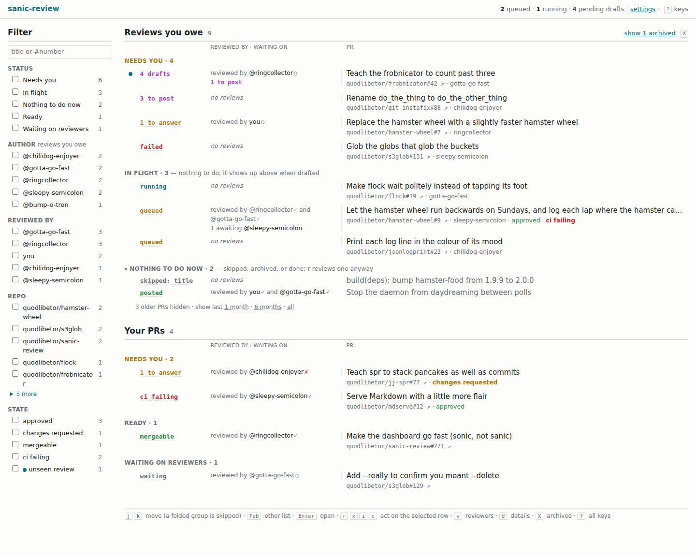
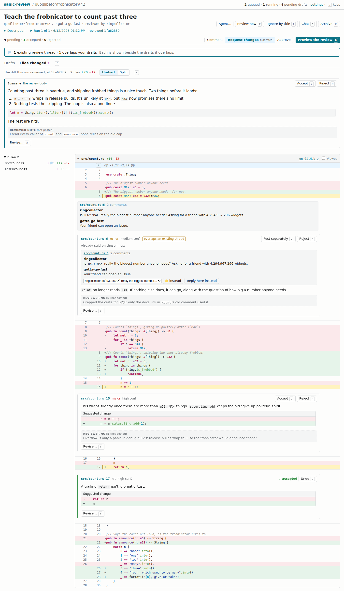

# sanic-review

Review things really really fast, if you consider AI reviewing things review.

sanic-review watches GitHub as you: review requests, pushes, replies,
approvals. When someone requests your review, pushes to a PR you've reviewed,
or marks a draft ready, it checks the PR out and runs a read-only `claude -p`
agent over it. The agent drafts review comments. You
read them, edit them, accept or reject them, and then, if you click the
button, they're posted as a normal GitHub review under your name.

Nothing is posted until you click.

<picture>
  <source media="(prefers-color-scheme: dark)" srcset="docs/images/index-dark.png">
  
</picture>

## What it isn't

- **It isn't a substitute for reading the code.** It's a way to start a
  review with a pile of opinions already written down. Some of them will be
  wrong, confidently. You're the one posting them.
- **It isn't free.** Every review spends your Claude tokens, and polling
  spends your GitHub rate limit. So out of the box it holds every review
  until you start it (manual reviews); turn that off, with `m` in the TUI or
  the dashboard's settings, once you'd rather it just reviewed.
- **It only drafts reviews of other people's PRs, for now.** Replies in
  threads you're in, and comments on your own PRs, show up as things to
  answer, but it doesn't draft answers or fixes for them yet.

## Safety model

As implemented, not as hoped:

- **Nothing is posted or pushed without an explicit action from you**: a
  click in the dashboard, or a command you run. The only code that writes to
  GitHub is the dashboard's submit path, and it shows you every request it
  will send, with its exact body, before you confirm.
- **Agents get read-only tools and no GitHub credentials.** Reviews run
  `claude -p` with only Read, Grep and Glob, `--restricted` to the checkout
  and the directories you configure, and no MCP servers. Environment
  variables that look like GitHub tokens are removed before it starts. PR
  text is fenced as data in the prompt, but prompt injection is still
  possible; the mitigation is that the worst the agent can do is write a bad
  draft, which you then read.
- **The agent can read what you let it read.** That includes the local
  checkouts in your config and their untracked files (`.env`, say). A
  poisoned PR could get it to quote one into a draft. Read drafts before
  posting them.
- **The dashboard is localhost-only.** It binds `127.0.0.1`, checks the
  `Host` header, and requires a token generated at startup on every
  state-changing request. When the browser says where a request came from
  (`Origin`, `Sec-Fetch-Site`), it must be the dashboard itself. Approvals must
  be picked on the PR page, never taken from a URL.

The details are in [docs/DESIGN.md](docs/DESIGN.md#security).

## Install

Releases are built by [dist](https://github.com/axodotdev/cargo-dist) when a
version tag is pushed, for macOS and Linux (glibc) on arm64 and x86_64.

Homebrew:

```sh
brew install quodlibetor/tap/sanic-review
```

Installer script, from the latest GitHub release:

```sh
curl --proto '=https' --tlsv1.2 -LsSf https://github.com/quodlibetor/sanic-review/releases/latest/download/sanic-review-installer.sh | sh
```

Or download a tarball from the
[releases page](https://github.com/quodlibetor/sanic-review/releases). The
macOS binaries aren't signed; a tarball downloaded with a browser gets the
quarantine flag, which you can clear with
`xattr -d com.apple.quarantine sanic-review`.

From source:

```sh
cargo install --locked --git https://github.com/quodlibetor/sanic-review sanic-review
```

## Quick start

You need:

- the `claude` CLI (Claude Code) on your `PATH`, logged in;
- a GitHub token: `GITHUB_TOKEN` if it's set, otherwise whatever
  `gh auth token` prints. Team review requests need the `read:org` scope.
- `git`, and your usual git credential helper for private repos.

Then:

```sh
sanic-review serve
```

With no config yet, this opens the config editor first: every key, with
`f` to suggest your teams, orgs, local checkouts, models and skills, and
live counts of the repos and PRs the config watches. It checks the config
as you go, shows the diff, and writes it only once it loads and you say
yes, keeping the file's comments and layout; `serve` then starts with it.
Later, `e` in the TUI opens the same editor, and `sanic-review setup` opens
it without starting `serve`, say when `serve` runs under systemd.

`serve` runs in the foreground: it polls GitHub, runs reviews and serves the
dashboard, logging its URL on startup (`o` in the TUI opens it). Its options:

```
--ui <logs|tui>        log lines, or a terminal UI (the default in a
                       terminal, unless in the background)
--port <PORT>          dashboard port, bound on 127.0.0.1
--config <CONFIG>      defaults to ~/.config/sanic-review/config.toml
--data-dir <DATA_DIR>  defaults to ~/.local/share/sanic-review
--manual-reviews       turn manual reviews on in the config
```

The first poll records what's already there without reacting to it. Standing
review requests do count, so manual reviews start on: they're queued and
held, and nothing runs until you start one (`r` in the TUI, Review now on
the dashboard, or `sanic-review review`). Turning them off starts the held
ones, after saying how many, a few at a time (`runner.max_concurrent`).

Other commands:

```sh
sanic-review review <PR url>     # ask the running serve to review a PR now
sanic-review archive <PR url>    # stop reviewing it automatically (unarchive undoes it)
sanic-review chat <PR url>       # ask the agent about its review; see --help
sanic-review setup               # the config editor, without starting serve
```

## A short tour

**The index** lists "Reviews you owe" and "Your PRs", grouped by what they
want from you. Reviews you owe are **Needs you** (drafts to decide on,
comments to answer, a review you haven't looked at, a failed or held run),
**In flight** and **Nothing to do now**. Your PRs are **Needs you**, **Ready** and **Waiting on reviewers**.
Each row leads with its one next thing and says who has reviewed it and how.
Only PRs with recent activity are shown; a line under each list says how many
older ones are hidden and lets you widen the window.

**Drafts.** A PR page shows the latest review's summary and comments, each
with the diff lines around it. Click a draft (or press `e`) to edit it; `y`
accepts, `n` rejects, `u` undoes. Pick a verdict, preview exactly what will
be sent, and confirm. Drafts on lines that aren't in the diff go into the
review body instead of being dropped.


**Regenerate with instructions.** "Agent…" resumes the review's agent session
with your instruction ("drop the nits", "you misread the locking, look
again") and produces a new run with revised drafts. The agent is told to
keep drafts you accepted or edited word for word unless you ask otherwise,
and not to bring back ones you rejected. The original run is left alone. It's
refused once the PR has new commits; start a fresh review then.

**Existing threads.** When a draft lands on lines someone has already
commented on, the draft says so and shows the thread. Instead of posting a
duplicate, you can 👍 a comment in that thread, post the draft as a reply
there, or post it separately anyway.

**Files changed.** `f` switches a PR page to the whole diff the run reviewed,
laid out like GitHub's Files changed tab, with the drafts and existing
threads inline, syntax highlighting, unified or split (`s`), per-file Viewed
boxes, and expandable context read from the local mirror.



**Profiles** decide how PRs get reviewed. Each profile matches repos (by
org, `owner/name` or local checkout, optionally narrowed by path globs) and
brings its own instruction files, skill directories and model. The most
specific match wins.

**Archive and ignore.** `x` archives a PR: it gets no more automatic reviews
and is hidden unless you ask to see archived PRs. `i` opens an editor that turns a PR's
title into a `skip_titles` glob (say, `build(deps)*`), previews which reviews
it would skip, and adds it to your config.

**The TUI** (`serve --ui tui`) is a summary of reviews you owe, your PRs,
activity and the log, plus a config editor. Its keys:

| Key | Does |
|-----|------|
| `j`/`k`, `g`/`G`, Tab/Shift-Tab | move, jump to first/last, switch pane |
| `w` `p` `a` `l` | jump to a pane |
| `o` | open the selected PR (or the index) in the dashboard |
| `r` | start a failed, skipped, archived or held review, after confirming |
| `x` / `X` | archive or unarchive / show archived |
| `i` | ignore PRs by title |
| `m` | turn manual reviews on or off; off asks first when that starts held reviews |
| `c` | chat with the agent that reviewed the selected PR |
| `e` | edit the config: every key, list, repo entry and profile, checked as you go, saved after showing the diff |
| `z` / `Z` | cycle a pane through fit, full screen and collapsed / reset |
| `?` | help |
| `q` | quit `serve`, after listing any running reviews it would cancel |

The dashboard uses the same keys where they make sense in a browser; `?`
lists them.

**The config editor** (`e`, `setup`, or a first `serve`) reads as the config
file, each key commented with what it does, unset ones commented out with
their default, and says under it what the config does: the repos it
watches, the reviews you're asked for, your open PRs.

| Key | Does |
|-----|------|
| `j`/`k`, `g`/`G` | move a row, jump to first/last |
| Tab, `]` / Shift-Tab, `[` | the next table / the one before |
| Enter | edit a key, flip a bool, open a repo entry, rename a profile |
| `+` / `-` | add or remove a list item, repo entry, glob or profile |
| `K` / `J` | move one up or down, since order decides what wins |
| `f` | suggest teams, orgs and checkouts, models, skills or instructions |
| `u` | unset a key, back to its default |
| `v` / Ctrl-S | show the diff / save, after showing it |
| Esc, `q` | back out of an entry, or leave, asking about unsaved edits |

While typing, Enter sets, a blank unsets and Esc cancels. What the field
could hold drops down under it as you type (paths, models, your teams,
orgs and repos, a profile's skills and instructions, a key's few values):
↑/↓ choose, Tab takes the chosen one or else the first, Enter takes the
chosen one, and Esc closes the list. Fields take readline's emacs keys
(Ctrl-A/E/B/F/K/U/W, Alt-B/F, the arrows, Home/End), or vi's with
`keys = "vi"` under `[tui]`: typing starts in insert mode, Esc goes to
normal mode, and Esc there drops a half-typed command (`d`, `f`, a
count…) or else cancels. Unset, it's vi if `~/.inputrc` sets
`editing-mode vi`, or else if `$VISUAL` or `$EDITOR` is a vi.

For how any of this actually works, see [docs/DESIGN.md](docs/DESIGN.md).

## Configuration

`~/.config/sanic-review/config.toml`. The config editor writes it, and hand
edits are fine too: `serve` reloads it when it changes and keeps comments and layout
when it edits it. A minimal one:

```toml
[runner]
manual_reviews = false            # run queued reviews by themselves; on unless set

[review_requests]
skip_titles = ["build(deps)*"]    # never auto-review these

[profile.default]
instructions = ["~/.config/sanic-review/instructions/general.md"]
skills = []                       # directories of SKILL.md skills
model = "auto"                    # your claude default; or name a model
repos = [
  { github = "your-org" },
  { repo = "~/src/your-repo", paths = ["/backend/**"] },
]
```

Instruction files are appended to the agent's system prompt, so that's where
your house style and pet peeves go. Every option, and how matching and
precedence work, is in [docs/DESIGN.md](docs/DESIGN.md#configuration).

## Development

```sh
mise run check
```

That's the gate: fmt, clippy with `-D warnings`, cargo-deny, the dist
workflow check, and the tests. CI runs the same thing. Tests never touch the
network or spend tokens; GitHub, `claude` and the clock sit behind fakes.

- Read [docs/DESIGN.md](docs/DESIGN.md) before changing behaviour, and
  update it when behaviour changes.
- `mise run screenshots` regenerates the screenshots above from invented
  data. It needs Chrome, and on Linux it downloads a pinned emoji font once.
- [CLAUDE.md](CLAUDE.md) has the conventions (dependencies, errors, logging).
- Nothing may post to GitHub or push except through an explicit user action.
  Don't add code paths that weaken that.

### Releasing

```sh
mise run release            # bump the patch version
mise run release 0.2.0      # or release a version you pick
mise run release --push     # and push main and the tag
```

It commits the version on `main` as `chore: release vX.Y.Z`, runs the gate
on that commit, tags it, and moves `main` to it. Pushing the tag is what
publishes, so without `--push` it stops and prints the push commands. Start
from an empty working copy on a `main` that matches `origin`'s (`jj git
fetch`, `jj new main`). If the gate fails it prints the `jj abandon` that
discards the release change. Details are in
[docs/DESIGN.md](docs/DESIGN.md#releases).

## License

Licensed under either of [Apache License, Version 2.0](LICENSE-APACHE) or
[MIT license](LICENSE-MIT), at your option.
